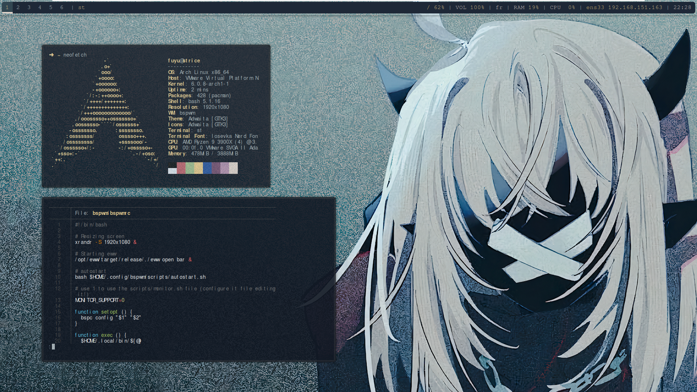
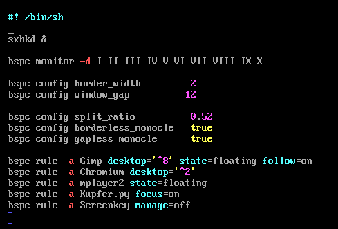
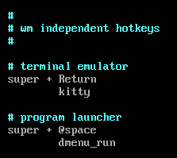

# fuyutaa's dotfiles!

These are used in this video on my channel, fuyutaa - hacking et cybersec.


## Description

These are the dotfiles for my DEMONDICE Arch Linux rice!
There are hotkeys, Window animations and more!
I tried to keep the configuration simple: for example, I did not used EWW (Elkowar's Wacky Widgets) but Polybar(one package, easier to configure...).

In the README.md, I present you the project, but if you want a full tutorial, look in the full-guide.md!

## If you like my dotfiles !

Feel free to give me a star on this repo 🙂!

### Dependencies

This rice uses the following packages/wm/etc... :

| Package             | Role                    |
| --------------------|-------------------------|
| xorg                | Display server          |
| bspwm               | Window manager          |
| sxhkd               | Hotkeys daemon          |
| lightdm             | GUI: Desktop and login  |
| lightdm-gtk-greeter | lightdm tool            |
| st                  | Suckless terminal       |
| picom               | Compositor (fork)       |
| bash                | The shell               |
| feh                 | Background handler      |
| dunst               | Custom notifications    |
| bat                 | Improved cat            |
| exa                 | Improved ls             |
| rofi                | App Launcher            |
| starship            | Custom icons for files  |
| polybar             | The B A R               |
| neovim              | Text editor             |
| git                 | Github repo cloner      |

> These packages may need other depedencies that will be installed udring the package installation.
> You will also need yay to install some of the stuff.

## Pre-install: on a new system
>The following commands are intented to be executd right after a fresh install of your linux.
It means, for example, you just installed Arch Linux with archinstall and rebooted, with a minimal profile and no packages already installed.

We need to get a stable desktop before ricing. We'll install the basic packages and unsure everything works properly before ricing. If you directly install the full rice with dotfiles without ever going on desktop, there are great chances your system breaks. This is why we will make a stable state before continuing with the rice.

* Update your sources
```shell
sudo pacman -Syy
```

* Install the basic packages
See their roles in the table above. Only kitty is not listed, it's just a basic terminal
```shell
sudo pacman -S xorg bspwm sxhkd lightdm lightdm-gtk-greeter vim firefox kitty
```

* Creating .config and adding example config files
```shell
mkdir .config
cd .config
mkdir bspwm
mkdir sxhkd
cp /usr/share/doc/bspwm/example/bspwmrc bspwm/
cp /usr/share/doc/bspwm/example/sxhkdrc sxhkd/
```
* Modifying bspwmrc
```shell
vim bspwm/bspwmrc
```
For bspwmrc, you must remove everything before "sxhkd &" on the same line. 
The file should look like that:


* Modifying sxhkdrc
```shell
vim sxhkd/sxhkdrc
```
For sxhkdrc, you must change the program started by "Super + Return" to "kitty". 
The file should look like that:



* Create lightdm symlink
```shell
systemctl enable lightdm
```

* Reboot and test things.
You may now reboot. You should now get a login page, and upon logging, a black screen. If you can open kitty using the Super + Return shortcut, you should be able to continue to the the actual rice!

## Installing
* Install all the depedencies with pacman except st and picom
```shell
sudo pacman -S xorg bspwm sxhkd lightdm lightdm-gtk-greeter feh dunst bat exa rofi starship polybar neovim git
```

* Install yay
```shell
sudo pacman -S --needed base-devel
sudo git clone https://aur.archlinux.org/yay.git
sudo chown -R  USERNAME:USERNAME yay
cd yay
makepkg -si
```

* Install [Arian8j2 picom fork](https://github.com/Arian8j2/picom) with yay
You must run the following command:
```shell
yay picom
```
And select the one that has "Arian8j2" in the name.

* Make the .config folder and subfolders
```shell
mkdir .config
mkdir .config/bspwm
mkdir .config/sxhkd
mkdir .config/polybar
mkdir .local
mdkir .local/bin
```

* Clone the repository

* Execute the following commands to set-up dotfiles:
```shell
cp -r ./config/* ~/.config
cp -r ./home/bashrc ~/.bashrc
cp -r ./home/Xresources ~/.Xresources
cp -r ./bin/* ~/.local/bin
```

* Compile my version of st:
```shell
cd ~/.config/st
./rebuild.sh
```

* Enable the GUI
```shell
systemctl enable lightdm
```

* Make polybar startup script be executable
```shell
chmod +x ~/.config/polybar/launch.sh
```

* Reboot your system and done!

Done! Easy right?
You won't have a fancy login page, but doesn't matter as it's just the login page.

## Shortcuts (sxhkd)

| Shortcut                 | What it does                |
| -------------------------| ----------------------------|
| super + w                | Close window                |
| super + shift + return   | Open rofi (app launcher)    |
| super + return           | Open st terminal            |
| super + b                | Open firefox                |
| super + tab              | Switch monocle/tiled mode   |
| super + t                | Switch to tiled mode        |
| super + f                | Switch to fullscreen mode   |
| super + space            | Switch to floating mode     |
| super + ctrl + {h,j,k,l} | Move a floating window      |
| super + alt + {h,j,k,l}  | Resize active window        |
| super + escape           | Reload sxhkd config file    |


## Version History

* 1.0
    * First version. Polybar needs to be improved.

## License

This project is licensed under the MIT License - see the LICENSE.md file for details

## Credits
For this project, I mixed dotfiles from different people, customized, re-edited, removed scripts and added mine.
As for the original dotfiles, thanks to:
* [AlphaTechnolog, sxhkd and other](https://github.com/AlphaTechnolog/dotfiles)
* [Ruturajn, starship.toml](https://github.com/Ruturajn/Dotfiles/blob/main/starship.toml)
* [Arian8j2, picom fork](https://github.com/Arian8j2/picom)
* DEMONDICE for the wallpaper. I improved the quality and upscaled the image with AI to make it fit.
